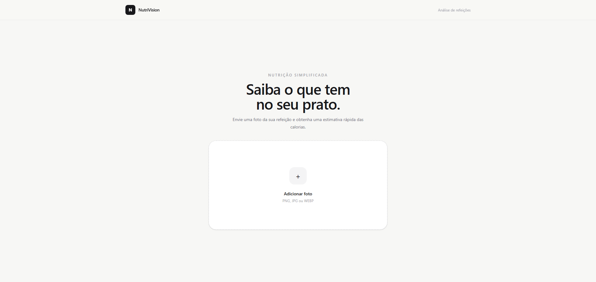

# App to Calculate Calories

> Web application for calculating daily calorie needs based on user information.

[](#status)
[](#license)

**Web Application** · **React** · **TypeScript** · **Vite**

[Live Demo](https://teste-jet-phi.vercel.app/) · [Repository](https://github.com/Leo11772/app-to-calculate-calories)

---

## Overview

App to Calculate Calories is a web application designed to calculate
daily calorie needs based on user-provided information.

The project focuses on **clean UI**, **reusable components** and
**type-safe development**, providing a simple and responsive experience.

---

## Features

- Daily calorie calculation
- User data input
- Dynamic calculation results
- Form validation
- Responsive interface

---

## Preview



> Screenshot of the working web app.

---

## Tech Stack

| Layer | Technologies |
|---|---|
| **Frontend** | React, TypeScript |
| **Build Tool** | Vite |
| **Styling** | Tailwind Css |
| **Code Quality** | ESLint |
| **Tools** | Git, GitHub |

---

## Architecture

```text
User
  ↓
React Interface
  ↓
Form Validation
  ↓
Request API
  ↓
Calculation Logic
  ↓
Results
